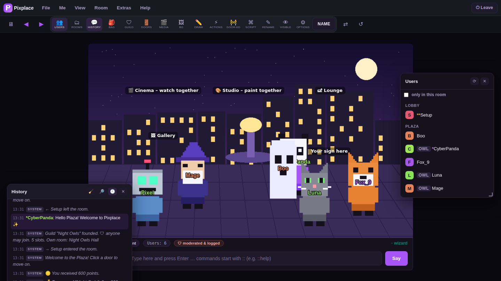
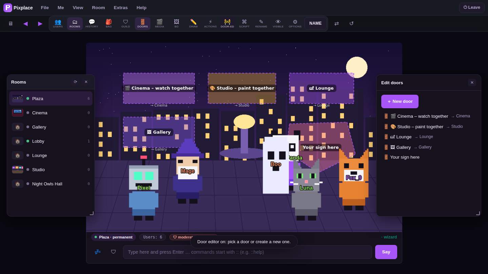
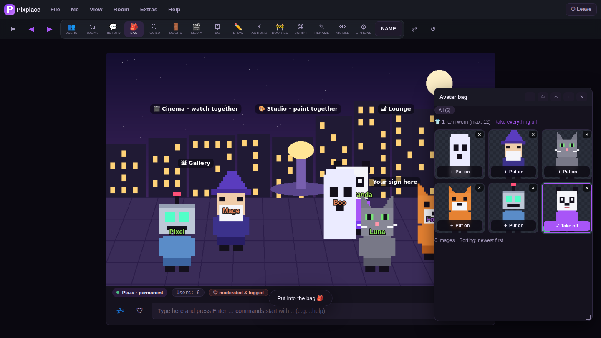
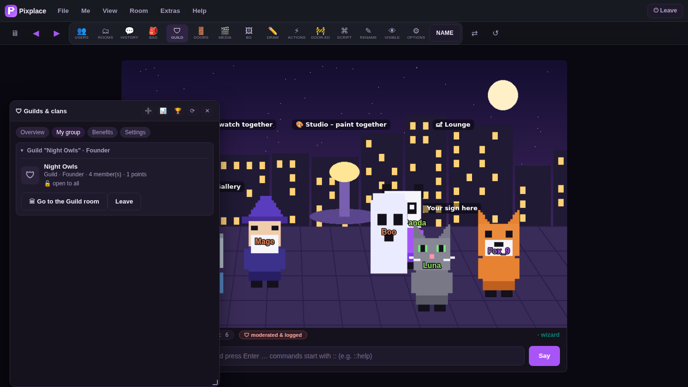
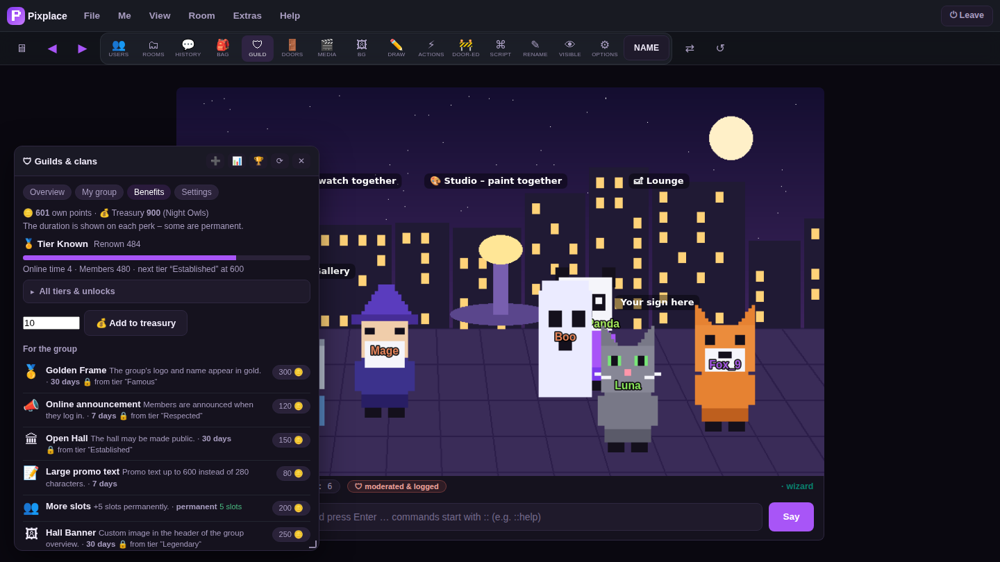
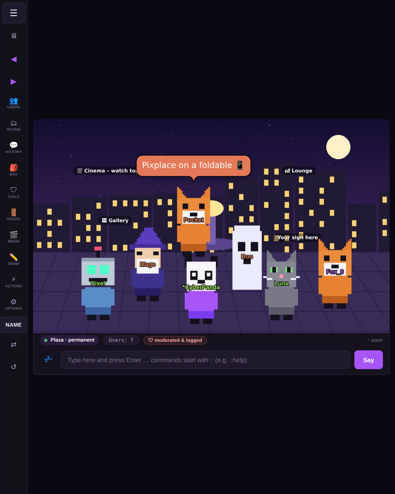
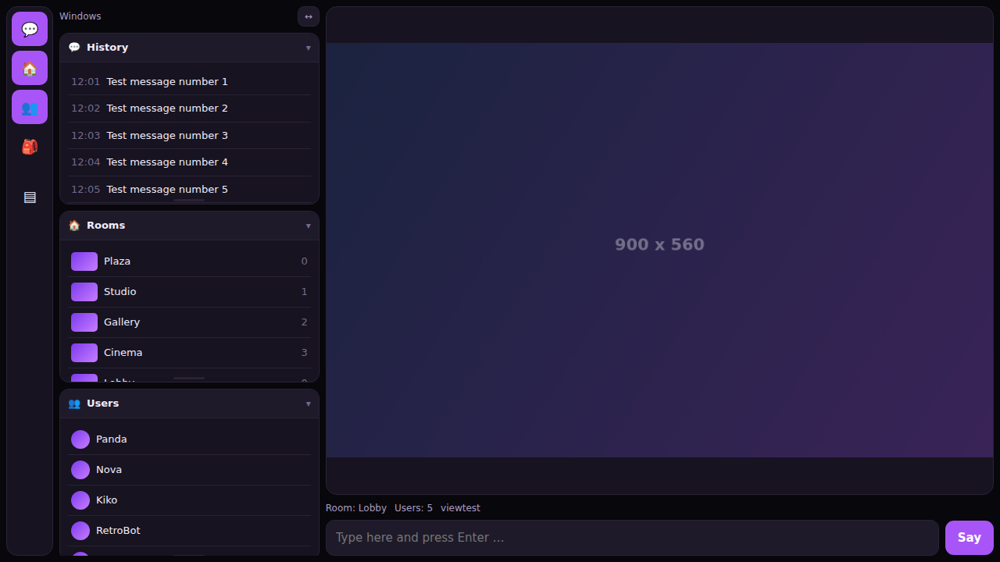
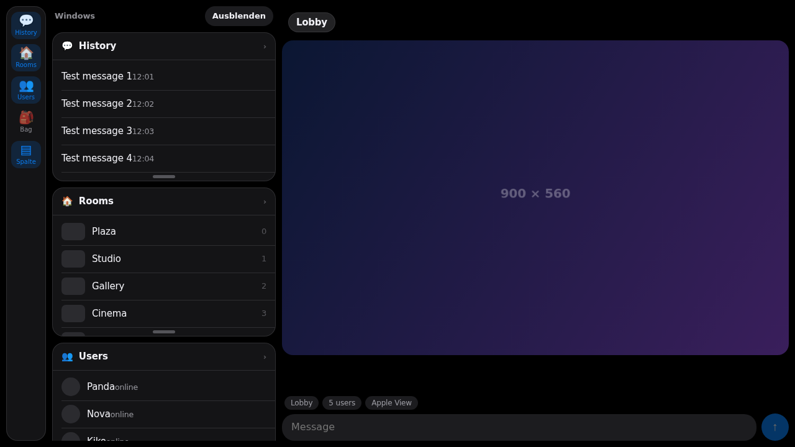

<div align="center">

# Pixplace

**A 2D avatar chat for the browser – an experimental fan project in memory of The Palace.**


[](https://chat.pixplace.org)

**[🌐 Live demo: chat.pixplace.org](https://chat.pixplace.org)**

*Made by [CyberPanda](https://github.com/cyberpanda) · GitHub [@cyberpanda](https://github.com/cyberpanda) · X [@realcyberpanda](https://x.com/realcyberpanda)*



</div>

---

## Hello, I'm CyberPanda 👋

I have been an **original Palace user since 1998**. Pixplace is my **pure fan project** and a love letter to that software and the online places it made possible. It is also influenced by **[pchat.org](https://pchat.org)**, where I have been a user for many years.

It was built together with [Claude](https://claude.ai) (an AI assistant by Anthropic). Building something like this myself had been on my bucket list, so I wanted to see how far I could get with AI and a few months of testing.

> **In memory of The Palace, the 1990s chat software, and in tribute to pchat.org.**

### How it differs from the original

- **No proprietary protocol.** Pixplace does not use the Palace wire protocol. Everything runs over plain **WebSocket (`ws`/`wss`) and HTTP(S)** on a single port.
- **No Palace or pchat.org code, assets or protocol specs were used.** It is an independent implementation written from scratch.
- The *idea* of a 2D avatar chat – rooms, speech bubbles, doors, props, scripting – is a general software concept. Pixplace is a different program with its own code, its own protocol and its own look.
- It is not affiliated with The Palace or pchat.org. All names belong to their respective owners.

### Palace meets MMORPG

Besides the classic Palace feel, Pixplace combines in things I loved about **MMORPGs**. You can **build groups** and call them whatever you like – clan, guild, crew, club. Groups have their own ranks and rights, a shared treasury and their own hall. By being active you **gain rewards, just like in games**: points for time spent online, renown for your group, and perks you can unlock with them. I love both worlds, so I wanted to bring the two ideas together.

---

## Status: experimental, not finished

Pixplace is **experimental**, and it ships with **different experimental views**. I wanted it to work on **mobile devices and especially foldables** (like the Galaxy Z Fold or dual-screen devices), and these views are my attempts at that. They are prototypes, not polished products.

Making it properly mobile turned out to be a **hard challenge**. Between my **full-time job** and other ongoing projects, I cannot maintain Pixplace on my own. The project is **far from finished**, and I have put a good amount of time into it. That is exactly why it is open source now: **contributions are very welcome.**

| View | What it is |
|---|---|
| **Desktop** | The classic window layout with draggable panels |
| **Split** | Chat and room side by side, aimed at tablets and unfolded foldables |
| **Viewtest** (`/viewtest`) | Experimental card-based layout for narrow and folding screens |
| **Apple View** (`/viewapple`) | Experimental sidebar layout with collapsible cards |
| **Focus / Cinema** | Placeholders – not implemented yet |

### Screenshots

| | |
|---|---|
|  |  |
|  |  |

**Tablet / unfolded foldable size**



**Experimental views** (prototype pages with demo data)

| Viewtest | Apple View |
|---|---|
|  |  |

*The sample avatars and backgrounds in the screenshots are original pixel art made for this project.*

---

## Features

| | |
|---|---|
| **Avatars** | Upload pictures, cut out backgrounds, wear up to 12 layered at once |
| **Rooms & doors** | Rooms with their own backgrounds, linked by doors, lockable with one click |
| **Groups, clans & rewards** | Build groups and name them as you like (clan, guild, crew, club); custom ranks and rights, treasury, renown, perks and a leaderboard – earn rewards like in games |
| **Watch together** | Share a video – it plays for everyone at once, or audio only |
| **Whisper & group chat** | Private messages across rooms, plus a members-only channel |
| **PPScript** | Rooms react to events: greet, count, redirect. One line, one command |
| **Drawing** | Paint together on the room canvas |
| **Multilingual** | English is the main language; German, Spanish, French, Italian, Portuguese, Dutch, Polish and Japanese included |
| **Installable** | PWA – add it to your home screen |

### PPScript

PPScript is a tiny scripting language for rooms and doors (not related to the original Palace "iptscrae" language – it is its own small thing). One line is one command:

```
ON ENTER
  ADD visits 1
  SAY "Welcome, {user}! You are visitor no. {var.visits}."
END

ON SAY "sesame"
  SAY "The door opens …"
  GOTO Gallery
END
```

Scripts run **server-side** with hard limits (steps, lines, output). The full manual is served at `/manual`.

---

## Live demo

Try it in your browser: **[chat.pixplace.org](https://chat.pixplace.org)**

## Quick start

```bash
git clone https://github.com/cyberpanda/pixplace.git
cd pixplace/server
python3 server.py
```

Open <http://127.0.0.1:9998>. That is all – **no dependencies, Python standard library only** (Python 3.10+). On first start the server prints a one-time owner password; change it after signing in.

| Path | What |
|---|---|
| `/` | Landing page |
| `/app` | The chat |
| `/admin` | Admin panel (owner password) |
| `/manual` | PPScript manual |
| `/imprint` `/privacy` `/terms` | Legal pages (see [LEGAL.md](LEGAL.md)) |
| `/status` | Public status page |

### Other ways to run it

```bash
make run              # foreground
sudo make install     # systemd service (see deploy/pixplace.service)
docker compose up -d  # Docker, data in a volume
```

For public use put a TLS reverse proxy in front – examples for **Caddy** and **nginx** are in [`deploy/`](deploy/).

Optional extras: `pip install cryptography` is only needed for "Sign in with Apple".

---

## Repository layout

```
server/   Server (single Python file, stdlib only) + 2FA helpers
client/   Browser client (client.html) and the experimental views
lang/     Language files – one line per entry: key = text
deploy/   systemd, Caddy, nginx examples
docs/     Screenshots
tools/    Helper scripts (tools/check.sh)
```

Runtime data (accounts, rooms, uploads, logs) is written next to `server.py` – or to the directory in the `PIXPLACE_DATA` environment variable – and is git-ignored.

## Adding a language

1. Copy `lang/en.lang` to `lang/xx.lang`
2. Translate the right-hand side of each `key = text` line
3. Restart – the language appears in the 🌐 picker automatically

Missing keys fall back to English, so partial translations work.

---

## Security and compliance

Security and regulatory requirements were a priority while building this. Highlights:

- Rate limiting for connections, chat floods, uploads and admin login, with brute-force back-off
- Passwords and access keys stored only as irreversible hashes
- Optional **two-factor authentication (TOTP)** with recovery codes
- Sign-in via Google/Apple with full token verification (signature, issuer, audience, expiry; `alg: none` rejected)
- Server-side enforcement of every permission and script limit – the client is never trusted
- Privacy switches: three logging modes (`full`, `events`, `off`), optional IP storage, demo mode, automatic log retention
- GDPR tooling in the admin panel: access report (Art. 15), erasure (Art. 17), traceable legal log
- User reporting route for content (DSA-style notice process)
- Test mode, closed-circle mode and invitation-only registration

> This describes design goals, not a certification. Nothing here is legal advice – see [LEGAL.md](LEGAL.md) and review your own obligations before running a public server.

Found a security issue or vulnerability? **Please open an issue** on GitHub – see [SECURITY.md](SECURITY.md).

---

## Contributing

**Contributions are welcome!** Bug fixes, translations, new views for foldable and mobile devices, documentation, tests – all of it helps. See [CONTRIBUTING.md](CONTRIBUTING.md). Run `make check` before opening a pull request.

## Support

Please **no donations**. If you want to support the project, contribute code, translations, bug reports or ideas – see [CONTRIBUTING.md](CONTRIBUTING.md). You can also reach me on X: [@realcyberpanda](https://x.com/realcyberpanda).

## License

MIT © 2026 CyberPanda ([GitHub @cyberpanda](https://github.com/cyberpanda) · [X @realcyberpanda](https://x.com/realcyberpanda)). See [LICENSE](LICENSE).

Pixplace is an independent fan project. "The Palace", "pchat.org" and any other names mentioned are the property of their respective owners and are used here only for attribution and tribute.
